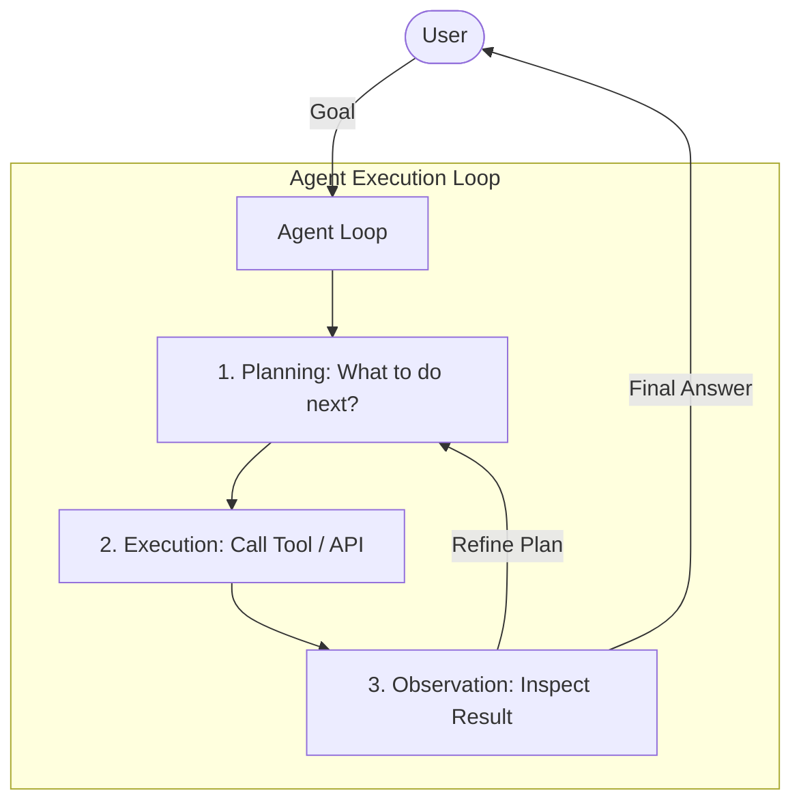
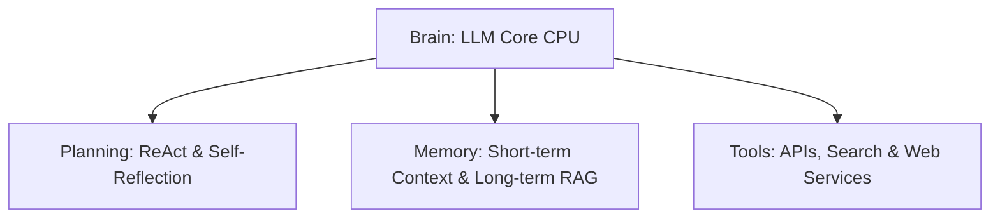

# Lesson 1: Foundations of Agentic AI

Welcome to Module 1 of the AI Agent Bootcamp. In this lesson, we will explore the foundational architectural blocks of autonomous agents, moving beyond simple chat interfaces into the realm of goal-driven digital workers.

## 1. What is an AI Agent?

An **AI Agent** is an autonomous entity powered by a foundation model (LLM) that can perceive its environment, formulate plans, use tools, maintain memory, and execute actions to achieve a specific, high-level goal without continuous human intervention.

Unlike traditional software (which follows hardcoded rules) or standard chat models (which wait for the next user query), an agent is **stateful** and operates inside a **continuous loop**:

---

## 2. Core Architectural Components

A robust agent is composed of four primary elements:

### A. The Brain (The Core LLM)
The LLM serves as the central processing unit (CPU) of the agent. It is responsible for parsing instructions, generating reasoning steps, selecting which tools to call, and formatting the final output. High-agentic-performance models (such as Claude 3.5 Sonnet, Gemini 1.5 Pro, and GPT-4o) are optimized for tool-calling accuracy, structural adherence (JSON), and long-context tracking.

### B. Planning
To solve complex, multi-step problems, an agent must break them down into smaller sub-tasks.
*   **ReAct (Reasoning + Acting):** The model generates a *Thought* (explaining its logic) followed by an *Action* (calling a tool), observes the *Observation* (the tool's output), and repeats until it reaches a *Final Answer*.
*   **Self-Reflection:** The agent evaluates its own output, checks for errors, and refines its plan if the tool returns a failure.

### C. Memory
*   **Short-Term Memory:** The in-context history of the current execution loop (the chat history and intermediate thought/action steps).
*   **Long-Term Memory:** External document retrieval (RAG) or key-value stores that persist across multiple sessions.

### D. Tools
Tools allow agents to interact with the physical and digital world. A tool is simply any function or API endpoint documented with a schema that describes its parameters and return values. Examples include database queries, file readers, code sandboxes, and web search engines.

---

## 3. The ReAct Loop

The **ReAct** (Reason + Action) pattern is the baseline loop for agentic execution. It forces the model to explain its rationale before executing a task:

1.  **Thought:** The agent reasons about the current state.
2.  **Action:** The agent decides to call a specific tool with defined parameters.
3.  **Observation:** The system executes the tool and feeds the result back into the agent's context.

This cycle continues dynamically until the goal is achieved. In the next lesson, we will implement this loop from scratch in Python.
