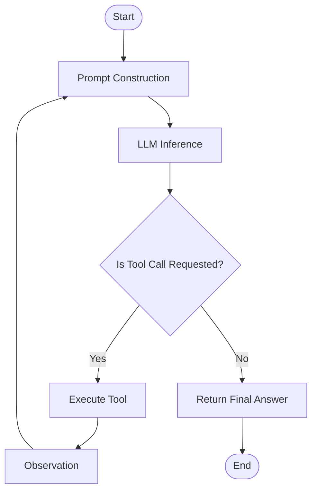

# Lesson 2: Single-Agent Design & Tool Integration

In this module, we will explore the design of a single-agent system and learn how to integrate external tools into an agent's execution loop using standard Python code.

## 1. Defining Tools

To make tools discoverable by an LLM, we must declare them using a structured schema (typically a JSON Schema) that specifies:
- The function **name**
- A detailed **description** of what it does
- The **parameters** it accepts (with types and descriptions)

For example, a calculator tool function and its corresponding schema:

```python
# The actual Python implementation
def calculate(expression: str) -> str:
    try:
        # Secure evaluation (in production, use a safe sandboxed engine)
        return str(eval(expression, {"__builtins__": None}, {}))
    except Exception as e:
        return f"Error: {str(e)}"

# The schema exposed to the LLM
tool_schema = {
    "name": "calculate",
    "description": "Evaluate mathematical expressions. Input must be a valid Python expression (e.g. '2 + 2' or '15 * 3.14').",
    "parameters": {
        "type": "object",
        "properties": {
            "expression": {
                "type": "string",
                "description": "The math expression to evaluate."
            }
        },
        "required": ["expression"]
    }
}
```

---

## 2. The Agent Loop Lifecycle

An autonomous single-agent loop runs sequentially through these phases:



1.  **System Prompting:** Injecting instructions telling the model it has access to tools and must output a specific format (e.g., JSON or special block tags like `Thought:` and `Action:`).
2.  **Inference:** The LLM generates text.
3.  **Parsing:** The wrapper extracts the tool name and arguments.
4.  **Execution:** The system runs the function locally and gets the output.
5.  **Feedback:** The system appends the observation to the context history and invokes the LLM again.

---

## 3. Handling Errors & Failures

In real-world environments, things go wrong. Agents must be resilient to:
*   **JSON Parsing Failures:** When the LLM generates malformed JSON tool calls. The wrapper should catch this error and feed the parser error back to the model, asking it to correct its output.
*   **Infinite Loops:** When the agent repeatedly calls the same tool with the same inputs. We prevent this by setting a strict limit on the number of iterations (e.g., `max_iterations = 5`).
*   **Tool Execution Errors:** If the API or tool throws an exception, we pass the exception description back to the agent as an observation so it can attempt to correct its parameters.

In the code examples folder, you can run `examples/01_react_loop.py` to see a full implementation of this architecture in action.

---

## 4. Hands-on Playground

Run and inspect the ReAct agent design pattern script directly in your browser:

<div class="my-6 p-5 glass-panel rounded-2xl border-blue-500/20 bg-blue-950/10 flex flex-col sm:flex-row justify-between items-center gap-4">
    <div class="flex items-center gap-3">
        <span class="text-2xl">⚡</span>
        <div>
            <h4 class="text-sm font-bold text-white uppercase tracking-wider font-mono">ReAct Loop Interactive Sandbox</h4>
            <p class="text-xs text-slate-400 mt-0.5">Explore how the agent parses prompts, invokes search, and executes iterations.</p>
        </div>
    </div>
    <button onclick="runLiveCode('01_react_loop.py', 'ReAct (Reason + Action) Loop')" class="text-center py-2 px-4 rounded-xl bg-blue-600 hover:bg-blue-500 text-white text-xs font-bold shadow-lg shadow-blue-500/20 transition-all cursor-pointer whitespace-nowrap">
        Access Sandbox
    </button>
</div>
