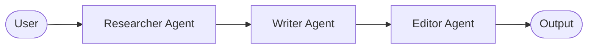
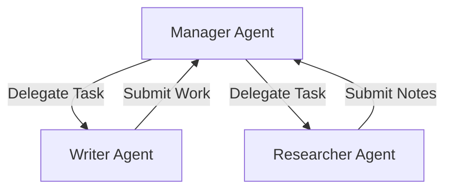

# Lesson 3: Multi-Agent Collaboration

As systems grow in complexity, a single agent can quickly become overwhelmed by too many tools, a large context window, or competing tasks. In this module, we will explore multi-agent architectures and collaboration frameworks.

## 1. Why Multi-Agent?

Single agents suffer from "tool bloat" and context dilution. By splitting tasks among specialized agents, we can:
*   **Encapsulate State:** Each agent only focuses on its specific task and has access to a tailored subset of tools.
*   **Improve Accuracy:** An agent designed strictly as a "Code Reviewer" performs better than a generalist agent trying to write, review, and deploy code in a single step.
*   **Scale Execution:** Agents can operate in parallel to solve complex workflows.

---

## 2. Multi-Agent Topologies

There are three primary collaboration structures:

### A. Sequential (Pipeline)
Tasks flow in a fixed, linear order from one agent to the next.


### B. Hierarchical (Manager-Worker)
A manager agent delegates sub-tasks to worker agents, gathers their observations, and reports the final answer.


### C. Graph (Conversational / Networked)
Agents talk to each other dynamically based on state changes. This is the most flexible topology, allowing loops, conditional branching, and human-in-the-loop validation.

---

## 3. Shared State & Context

For agents to cooperate, they must share information. There are two primary mechanisms:
1.  **Message Passing:** Agents send messages to one another directly.
2.  **Shared Memory (State Blackboard):** A centralized database or state graph (like in LangGraph) stores the global state. Every agent reads from and writes updates to this shared blackboard.

---

## 4. Multi-Agent Frameworks

Depending on your design requirements, you can choose from several standard frameworks:

| Framework | Topology Style | State Model | Ideal For |
| :--- | :--- | :--- | :--- |
| **CrewAI** | Role-based / Sequential | Shared memory & Tasks | Structured sequential business workflows |
| **LangGraph** | Cyclic Graphs | Shared state graph (Redux-style) | Complex, cyclic multi-agent software engineering loops |
| **AutoGen** | Conversational / Dynamic | Message passing | Multi-party debates, interactive simulations |
| **smolagents** | Code-first | In-context Python execution | Fast execution using LLMs that output Python directly |

---

## 5. Hands-on Playgrounds

Run and inspect the multi-agent patterns live directly in your browser:

<div class="grid grid-cols-1 md:grid-cols-2 gap-4 my-6">
    <div class="p-5 glass-panel rounded-2xl border-blue-500/10 bg-slate-900/20 flex flex-col justify-between gap-4">
        <div>
            <h4 class="text-xs font-bold text-white uppercase tracking-wider font-mono">CrewAI Collaboration Sandbox</h4>
            <p class="text-[11px] text-slate-400 mt-1">Sequential task execution with Researcher and Writer agents collaborating.</p>
        </div>
        <button onclick="runLiveCode('03_crewai_collaboration.py', 'CrewAI Collaboration Workflow')" class="w-full text-center py-2 rounded-xl bg-blue-600 hover:bg-blue-500 text-white text-xs font-bold shadow-lg shadow-blue-500/20 transition-all cursor-pointer">
            Access Sandbox
        </button>
    </div>
    <div class="p-5 glass-panel rounded-2xl border-blue-500/10 bg-slate-900/20 flex flex-col justify-between gap-4">
        <div>
            <h4 class="text-xs font-bold text-white uppercase tracking-wider font-mono">LangGraph Stateful Network Sandbox</h4>
            <p class="text-[11px] text-slate-400 mt-1">Stateful blackboard architecture implementing a cyclic Writer-Critic loop.</p>
        </div>
        <button onclick="runLiveCode('04_langgraph_workflow.py', 'LangGraph Stateful Cyclic Network')" class="w-full text-center py-2 rounded-xl bg-blue-600 hover:bg-blue-500 text-white text-xs font-bold shadow-lg shadow-blue-500/20 transition-all cursor-pointer">
            Access Sandbox
        </button>
    </div>
    <div class="p-5 glass-panel rounded-2xl border-blue-500/10 bg-slate-900/20 flex flex-col justify-between gap-4">
        <div>
            <h4 class="text-xs font-bold text-white uppercase tracking-wider font-mono">AutoGen Conversational Sandbox</h4>
            <p class="text-[11px] text-slate-400 mt-1">Multi-agent conversational session with a coder and UserProxy executor.</p>
        </div>
        <button onclick="runLiveCode('05_autogen_chat.py', 'Microsoft AutoGen Conversational Session')" class="w-full text-center py-2 rounded-xl bg-blue-600 hover:bg-blue-500 text-white text-xs font-bold shadow-lg shadow-blue-500/20 transition-all cursor-pointer">
            Access Sandbox
        </button>
    </div>
    <div class="p-5 glass-panel rounded-2xl border-blue-500/10 bg-slate-900/20 flex flex-col justify-between gap-4">
        <div>
            <h4 class="text-xs font-bold text-white uppercase tracking-wider font-mono">Self-Reflection Coding Sandbox</h4>
            <p class="text-[11px] text-slate-400 mt-1">Autonomous coding agent that executes output and iterates on exceptions.</p>
        </div>
        <button onclick="runLiveCode('06_self_reflection.py', 'Self-Correction Coding Agent')" class="w-full text-center py-2 rounded-xl bg-blue-600 hover:bg-blue-500 text-white text-xs font-bold shadow-lg shadow-blue-500/20 transition-all cursor-pointer">
            Access Sandbox
        </button>
    </div>
</div>

### 💻 Production Implementation Guides

To implement these multi-agent patterns in your own local codebase, you can use the official SDKs and frameworks. Expand any section below to view the production-ready script with step-by-step guidance.

<details class="group mt-4 glass-panel rounded-2xl border-blue-500/20 bg-slate-950/40 p-4">
<summary class="flex justify-between items-center cursor-pointer font-bold text-sm text-blue-400 hover:text-blue-300 select-none">
    <span>🚀 1. CrewAI Collaboration Guide</span>
    <span class="text-xs text-slate-500 group-open:hidden">▼ Expand</span>
    <span class="text-xs text-slate-500 hidden group-open:inline">▲ Collapse</span>
</summary>
<div class="mt-4 prose">

To run CrewAI locally using the Gemini API, install `crewai` and configure the model parameter:

```bash
pip install crewai
export GEMINI_API_KEY="your-api-key"
```

```python
#!/usr/bin/env python3
"""
Example 03: Real-World CrewAI Collaboration Workflow

This script demonstrates how to assemble a multi-agent team using the real CrewAI framework
connecting to the Gemini API via standard environment configuration.
"""

import os
import sys

try:
    from crewai import Agent, Crew, Process, Task
except ImportError:
    print("ERROR: 'crewai' package not found.")
    print("Please run: pip install crewai")
    sys.exit(1)

def main():
    # 1. Check for API key
    api_key = os.environ.get("GEMINI_API_KEY")
    if not api_key:
        print("ERROR: GEMINI_API_KEY environment variable is not set.")
        print("Please run: export GEMINI_API_KEY='your-key'")
        sys.exit(1)

    print("[*] Initializing CrewAI Agents with Gemini...")

    # We configure the model setting. CrewAI supports 'gemini/gemini-2.5-flash' out of the box.
    model_name = "gemini/gemini-2.5-flash"

    # 2. Define specialized Agents
    researcher = Agent(
        role="Senior Technology Researcher",
        goal="Gather and compile the latest trends in autonomous AI agent frameworks.",
        backstory="A detail-oriented analyst expert at scanning repository releases and standard updates.",
        verbose=True,
        llm=model_name
    )

    writer = Agent(
        role="Lead Technical Writer",
        goal="Synthesize raw research notes into a clear, executive intelligence briefing.",
        backstory="A communications specialist who converts complex technical details into readable articles.",
        verbose=True,
        llm=model_name
    )

    # 3. Define the Tasks
    research_task = Task(
        description="Identify the top 3 agentic developments in 2026, specifically looking at protocol standards like MCP.",
        expected_output="A list of 3 bullet points with brief technical descriptions.",
        agent=researcher
    )

    writing_task = Task(
        description="Review the researcher's bullet points and write a polished 2-paragraph briefing for an executive newsletter.",
        expected_output="A two-paragraph Markdown briefing.",
        agent=writer
    )

    # 4. Assemble and Run the Crew
    crew = Crew(
        agents=[researcher, writer],
        tasks=[research_task, writing_task],
        process=Process.sequential
    )

    print("\n[*] Starting sequential Crew task kickoff...")
    result = crew.kickoff()

    print("\n" + "="*50 + "\n[Crew Final Result]:\n" + "="*50)
    print(result)

if __name__ == "__main__":
    main()
```
</div>
</details>

<details class="group mt-4 glass-panel rounded-2xl border-blue-500/20 bg-slate-950/40 p-4">
<summary class="flex justify-between items-center cursor-pointer font-bold text-sm text-blue-400 hover:text-blue-300 select-none">
    <span>🔗 2. LangGraph Stateful Network Guide</span>
    <span class="text-xs text-slate-500 group-open:hidden">▼ Expand</span>
    <span class="text-xs text-slate-500 hidden group-open:inline">▲ Collapse</span>
</summary>
<div class="mt-4 prose">

To run LangGraph locally using the Gemini API, install `langgraph` and `langchain-google-genai`:

```bash
pip install langchain-google-genai langgraph
export GEMINI_API_KEY="your-api-key"
```

```python
#!/usr/bin/env python3
"""
Example 04: Real-World LangGraph Stateful Workflow

This script demonstrates how to build a stateful, cyclic agent workflow
using the official LangGraph library and the Gemini API.
"""

import os
import sys
from typing import TypedDict

try:
    from langchain_core.messages import BaseMessage, HumanMessage, AIMessage
    from langchain_google_genai import ChatGoogleGenerativeAI
    from langgraph.graph import StateGraph, START, END
except ImportError:
    print("ERROR: 'langchain-google-genai' or 'langgraph' package not found.")
    print("Please run: pip install langchain-google-genai langgraph")
    sys.exit(1)

# 1. Define the Graph State structure
class GraphState(TypedDict):
    document: str
    feedback: str
    revisions: int

def main():
    # Check for API key
    api_key = os.environ.get("GEMINI_API_KEY")
    if not api_key:
        print("ERROR: GEMINI_API_KEY environment variable is not set.")
        print("Please run: export GEMINI_API_KEY='your-key'")
        sys.exit(1)

    print("[*] Initializing Gemini LangGraph workflow...")
    # Initialize the Gemini model via LangChain integration
    llm = ChatGoogleGenerativeAI(model="gemini-2.5-flash", google_api_key=api_key)

    # 2. Define Node Functions
    def writer_node(state: GraphState) -> dict:
        revisions = state.get("revisions", 0)
        feedback = state.get("feedback", "")
        print(f"\n[*] [Node: Writer] Drafting/editing document (Revision: {revisions})...")

        prompt = "Write a one-sentence technical introduction to building AI agents."
        if feedback:
            prompt += f"\n\nPlease edit this draft based on the critic feedback: '{feedback}'"

        response = llm.invoke([HumanMessage(content=prompt)])
        return {
            "document": response.content,
            "revisions": revisions + 1
        }

    def critic_node(state: GraphState) -> dict:
        print("[*] [Node: Critic] Evaluating document quality...")
        doc = state.get("document", "")

        prompt = (
            f"Review this draft text: '{doc}'\n"
            "If the draft contains the phrase 'Model Context Protocol' or 'MCP', reply with the word 'Approved' followed by a short comment.\n"
            "If it does not contain 'MCP' or 'Model Context Protocol', reply with 'Feedback: You must mention the Model Context Protocol (MCP) as the standard tool connection layer.'"
        )

        response = llm.invoke([HumanMessage(content=prompt)])
        return {"feedback": response.content}

    # 3. Define the routing conditional edge logic
    def should_continue(state: GraphState) -> str:
        feedback = state.get("feedback", "")
        print(f"\n[*] [Router] Analyzing feedback: '{feedback}'")
        if "Approved" in feedback:
            print("[Router] Action: Draft approved! Routing to [END].")
            return "end"
        else:
            print("[Router] Action: Draft rejected. Routing back to [Writer] node.")
            return "writer"

    # 4. Compile the Graph
    workflow = StateGraph(GraphState)

    # Add Nodes
    workflow.add_node("writer", writer_node)
    workflow.add_node("critic", critic_node)

    # Set Entry Point
    workflow.add_edge(START, "writer")

    # Connect Nodes
    workflow.add_edge("writer", "critic")

    # Add Conditional Edges
    workflow.add_conditional_edges(
        "critic",
        should_continue,
        {
            "writer": "writer",
            "end": END
        }
    )

    app = workflow.compile()

    # 5. Run the Workflow
    initial_state = {
        "document": "",
        "feedback": "",
        "revisions": 0
    }

    print("\n[*] Starting LangGraph workflow execution...")
    final_output = app.invoke(initial_state)

    print("\n" + "="*50 + "\n[LangGraph Final State Output]:\n" + "="*50)
    print(f"Revisions: {final_output.get('revisions')}")
    print(f"Final Document: {final_output.get('document')}")
    print(f"Final Feedback: {final_output.get('feedback')}")

if __name__ == "__main__":
    main()
```
</div>
</details>

<details class="group mt-4 glass-panel rounded-2xl border-blue-500/20 bg-slate-950/40 p-4">
<summary class="flex justify-between items-center cursor-pointer font-bold text-sm text-blue-400 hover:text-blue-300 select-none">
    <span>🤖 3. Microsoft AutoGen Conversational Guide</span>
    <span class="text-xs text-slate-500 group-open:hidden">▼ Expand</span>
    <span class="text-xs text-slate-500 hidden group-open:inline">▲ Collapse</span>
</summary>
<div class="mt-4 prose">

To run AutoGen locally with Gemini, install `pyautogen` and configure the model dict:

```bash
pip install pyautogen
export GEMINI_API_KEY="your-api-key"
```

```python
#!/usr/bin/env python3
"""
Example 05: Real-World Microsoft AutoGen Conversational Session

This script demonstrates conversational agent communication using the Microsoft AutoGen framework
integrated with the Gemini API to collaboratively write and test code.
"""

import os
import sys

try:
    from autogen import AssistantAgent, UserProxyAgent
except ImportError:
    print("ERROR: 'pyautogen' package not found.")
    print("Please run: pip install pyautogen")
    sys.exit(1)

def main():
    # Check for API key
    api_key = os.environ.get("GEMINI_API_KEY")
    if not api_key:
        print("ERROR: GEMINI_API_KEY environment variable is not set.")
        print("Please run: export GEMINI_API_KEY='your-key'")
        sys.exit(1)

    print("[*] Initializing AutoGen Agents with Gemini API...")

    # Configure Gemini connection for AutoGen
    llm_config = {
        "config_list": [
            {
                "model": "gemini-2.5-flash",
                "api_key": api_key,
                "api_type": "google"
            }
        ],
        "temperature": 0.2
    }

    # 1. Create the Coder Assistant Agent
    assistant = AssistantAgent(
        name="assistant",
        llm_config=llm_config,
        system_message="You are a helpful AI assistant. Write clean Python code blocks. When you receive execution results showing errors, correct the code."
    )

    # 2. Create the User Proxy Agent (representing the user & executing code)
    # Note: we disable actual code execution to prevent running arbitrary commands locally,
    # or set it to mock execution responses, or use safe Docker.
    # To keep it simple and safe for local run:
    user_proxy = UserProxyAgent(
        name="user_proxy",
        human_input_mode="NEVER",
        max_consecutive_auto_reply=3,
        is_termination_msg=lambda x: x.get("content", "").rstrip().endswith("TERMINATE"),
        code_execution_config={
            "work_dir": "coding",
            "use_docker": False  # Use local environment for simple local runs
        }
    )

    # 3. Start the dialogue session
    task_query = "Write a python function `divide(a, b)` that divides a by b, and test it with divide(10, 0)."
    
    print(f"\n[User Query]: {task_query}")
    print("="*60)

    user_proxy.initiate_chat(
        recipient=assistant,
        message=task_query
    )

if __name__ == "__main__":
    main()
```
</div>
</details>

<details class="group mt-4 glass-panel rounded-2xl border-blue-500/20 bg-slate-950/40 p-4">
<summary class="flex justify-between items-center cursor-pointer font-bold text-sm text-blue-400 hover:text-blue-300 select-none">
    <span>🔍 4. Self-Reflection Coding Agent Guide</span>
    <span class="text-xs text-slate-500 group-open:hidden">▼ Expand</span>
    <span class="text-xs text-slate-500 hidden group-open:inline">▲ Collapse</span>
</summary>
<div class="mt-4 prose">

To run the self-reflection pattern locally, use the official `google-genai` SDK client:

```bash
pip install google-genai
export GEMINI_API_KEY="your-api-key"
```

```python
#!/usr/bin/env python3
"""
Example 06 (Real): Self-Reflection Coding Agent
This script uses the official Google GenAI SDK to draft python code,
runs it locally, intercepts any traceback errors, and sends the errors
back to Gemini to automatically correct the code.
"""

import os
import sys
import traceback
from google import genai
from google.genai import types

def run_user_code(code_str: str) -> str:
    """Safely executes the function in isolation and validates it."""
    local_scope = {}
    try:
        # Compile and execute the function definition
        exec(code_str, {}, local_scope)
    except Exception as e:
        return f"Compilation Error:\n{traceback.format_exc()}"

    # Verify function exists
    func = local_scope.get("divide_and_sum")
    if not func:
        return "Error: function 'divide_and_sum' was not defined in the namespace."

    # Validate with assertions
    try:
        # Test Case 1: Normal math
        res1 = func([10, 20, 30], 2)
        assert res1 == 30.0, f"Expected 30.0, got {res1}"

        # Test Case 2: Division by zero
        res2 = func([10, 20, 30], 0)
        assert res2 == 0, f"Expected 0 for division by zero, got {res2}"
        
        return "SUCCESS"
    except Exception as e:
        return f"Validation / Runtime Error:\n{traceback.format_exc()}"

def main():
    api_key = os.environ.get("GEMINI_API_KEY")
    if not api_key:
        print("ERROR: GEMINI_API_KEY environment variable is not set.")
        print("Please run: export GEMINI_API_KEY='your-key'")
        sys.exit(1)

    print("[*] Initializing Gemini Client...")
    client = genai.Client(api_key=api_key)

    prompt = """
    Write a Python function named `divide_and_sum(numbers: list, divisor: float) -> float`.
    It sum the numbers list and divide it by the divisor.
    If the divisor is zero, it must return 0.
    
    Provide ONLY the raw Python code block, nothing else. Do not wrap in backticks or markdown formats.
    """

    print(f"\n[*] Prompting Gemini to write the function...")
    
    # We construct the conversation history
    history = [
        types.Content(role="user", parts=[types.Part.from_text(text=prompt)])
    ]

    max_attempts = 3
    for attempt in range(1, max_attempts + 1):
        print(f"\n--- Attempt {attempt} ---")
        
        response = client.models.generate_content(
            model='gemini-2.5-flash',
            contents=history,
            config=types.GenerateContentConfig(
                temperature=0.2,
                system_instruction="You are an expert Python developer. Generate raw python code only. No comments or descriptions."
            )
        )
        
        code_output = response.text.strip()
        # Clean any accidental markdown code formatting
        if code_output.startswith("```"):
            lines = code_output.split("\n")
            if lines[0].startswith("```"):
                lines = lines[1:]
            if lines[-1].startswith("```"):
                lines = lines[:-1]
            code_output = "\n".join(lines).strip()

        print(f"[Gemini Drafted Code]:\n{code_output}")
        
        # Append response to history
        history.append(types.Content(role="model", parts=[types.Part.from_text(text=code_output)]))
        
        # Test it
        validation_result = run_user_code(code_output)
        
        if validation_result == "SUCCESS":
            print("\n[SUCCESS] Code passed all validation checks!")
            print("="*60)
            print("Final validated code:\n" + code_output)
            break
        else:
            print(f"\n[FAILURE] Code failed validation tests.")
            print(f"[Error Feedback]:\n{validation_result}")
            
            # Feed the error back to the model
            feedback_prompt = f"""
            The code you generated failed validation with the following error message:
            {validation_result}
            
            Please reflect on this traceback, locate the bug, and write the corrected code.
            Provide ONLY the raw python function.
            """
            history.append(types.Content(role="user", parts=[types.Part.from_text(text=feedback_prompt)]))
    else:
        print("\n[ERROR] Failed to compile and validate the code within iteration limits.")

if __name__ == "__main__":
    main()
```
</div>
</details>
