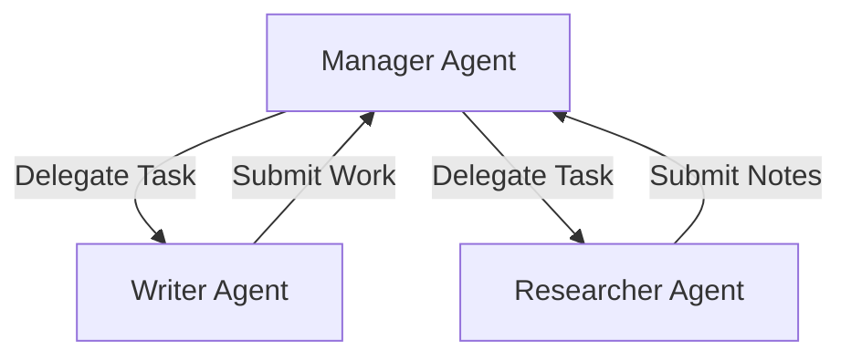

# Lesson 3: Multi-Agent Collaboration

As systems grow in complexity, a single agent can quickly become overwhelmed by too many tools, a large context window, or competing tasks. In this module, we will explore multi-agent architectures and collaboration frameworks.

## 1. Why Multi-Agent?

Single agents suffer from "tool bloat" and context dilution. By splitting tasks among specialized agents, we can:
*   **Encapsulate State:** Each agent only focuses on its specific task and has access to a tailored subset of tools.
*   **Improve Accuracy:** An agent designed strictly as a "Code Reviewer" performs better than a generalist agent trying to write, review, and deploy code in a single step.
*   **Scale Execution:** Agents can operate in parallel to solve complex workflows.

---

## 2. Multi-Agent Topologies

There are three primary collaboration structures:

### A. Sequential (Pipeline)
Tasks flow in a fixed, linear order from one agent to the next.

### B. Hierarchical (Manager-Worker)
A manager agent delegates sub-tasks to worker agents, gathers their observations, and reports the final answer.

### C. Graph (Conversational / Networked)
Agents talk to each other dynamically based on state changes. This is the most flexible topology, allowing loops, conditional branching, and human-in-the-loop validation.

---

## 3. Shared State & Context

For agents to cooperate, they must share information. There are two primary mechanisms:
1.  **Message Passing:** Agents send messages to one another directly.
2.  **Shared Memory (State Blackboard):** A centralized database or state graph (like in LangGraph) stores the global state. Every agent reads from and writes updates to this shared blackboard.

---

## 4. Multi-Agent Frameworks

Depending on your design requirements, you can choose from several standard frameworks:

| Framework | Topology Style | State Model | Ideal For |
| :--- | :--- | :--- | :--- |
| **CrewAI** | Role-based / Sequential | Shared memory & Tasks | Structured sequential business workflows |
| **LangGraph** | Cyclic Graphs | Shared state graph (Redux-style) | Complex, cyclic multi-agent software engineering loops |
| **AutoGen** | Conversational / Dynamic | Message passing | Multi-party debates, interactive simulations |
| **smolagents** | Code-first | In-context Python execution | Fast execution using LLMs that output Python directly |

---

## 5. Hands-on Playgrounds

Run and inspect the multi-agent patterns live directly in your browser:

    

        

            <h4 class="text-xs font-bold text-white uppercase tracking-wider font-mono">CrewAI Collaboration Sandbox</h4>
            
Sequential task execution with Researcher and Writer agents collaborating.

        

        <button onclick="runLiveCode('03_crewai_collaboration.py', 'CrewAI Collaboration Workflow')" class="w-full text-center py-2 rounded-xl bg-blue-600 hover:bg-blue-500 text-white text-xs font-bold shadow-lg shadow-blue-500/20 transition-all cursor-pointer">
            Access Sandbox
        </button>
    

    

        

            <h4 class="text-xs font-bold text-white uppercase tracking-wider font-mono">LangGraph Stateful Network Sandbox</h4>
            
Stateful blackboard architecture implementing a cyclic Writer-Critic loop.

        

        <button onclick="runLiveCode('04_langgraph_workflow.py', 'LangGraph Stateful Cyclic Network')" class="w-full text-center py-2 rounded-xl bg-blue-600 hover:bg-blue-500 text-white text-xs font-bold shadow-lg shadow-blue-500/20 transition-all cursor-pointer">
            Access Sandbox
        </button>
    

    

        

            <h4 class="text-xs font-bold text-white uppercase tracking-wider font-mono">AutoGen Conversational Sandbox</h4>
            
Multi-agent conversational session with a coder and UserProxy executor.

        

        <button onclick="runLiveCode('05_autogen_chat.py', 'Microsoft AutoGen Conversational Session')" class="w-full text-center py-2 rounded-xl bg-blue-600 hover:bg-blue-500 text-white text-xs font-bold shadow-lg shadow-blue-500/20 transition-all cursor-pointer">
            Access Sandbox
        </button>
    

    

        

            <h4 class="text-xs font-bold text-white uppercase tracking-wider font-mono">Self-Reflection Coding Sandbox</h4>
            
Autonomous coding agent that executes output and iterates on exceptions.

        

        <button onclick="runLiveCode('06_self_reflection.py', 'Self-Correction Coding Agent')" class="w-full text-center py-2 rounded-xl bg-blue-600 hover:bg-blue-500 text-white text-xs font-bold shadow-lg shadow-blue-500/20 transition-all cursor-pointer">
            Access Sandbox
        </button>
    

