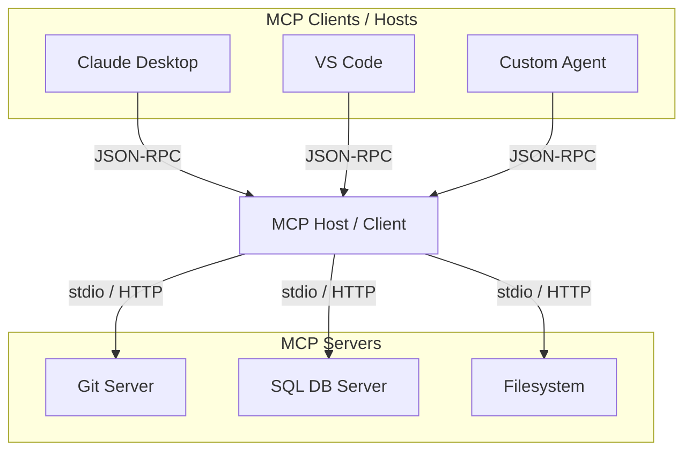

# Lesson 4: The Model Context Protocol (MCP)

As the AI agent ecosystem grows, connecting models to secure data sources and local tools has traditionally required building custom integrations for each IDE, framework, or app. In this lesson, we will explore the **Model Context Protocol (MCP)**, an open standard that addresses this challenge.

## 1. What is MCP?

Introduced as a universal standard, **Model Context Protocol (MCP)** is an open-source protocol that allows developers to build secure, standardized connections between AI models and their data sources. 

Instead of writing separate integrations for VS Code, Claude Desktop, LangChain, and custom systems, developers can write **one MCP server** that exposes tools, prompts, and resources. Any **MCP client** can instantly consume them:

---

## 2. MCP Architecture

MCP defines three main roles:

*   **MCP Client:** An application (like VS Code, Claude Desktop, or an agent framework) that wants to utilize external tools or resources. The client initiates connection to the MCP Host.
*   **MCP Host:** The orchestration layer that receives user inputs, communicates with the LLM, and routes tool-calling requests to the appropriate MCP Server.
*   **MCP Server:** A standalone service that exposes specific capabilities (Resources, Prompts, or Tools) via standard JSON-RPC over stdio or HTTP.

---

## 3. Capabilities of MCP

An MCP server can declare three main resources:
1.  **Tools:** Executable functions that the model can run (e.g. `read_file`, `execute_query`).
2.  **Resources:** Data payloads (files, API responses) that the model can read to gain context.
3.  **Prompts:** Predefined templates or system instructions that guide the model's behavior.

---

## 4. Setting Up an MCP Server

We can build MCP servers in Python or TypeScript. In the examples folder, you can view `examples/02_mcp_server.py` to inspect a minimal Python MCP server. To run an MCP server in your local IDE, you register the command inside the client's configuration file (e.g., `claude_desktop_config.json`).
