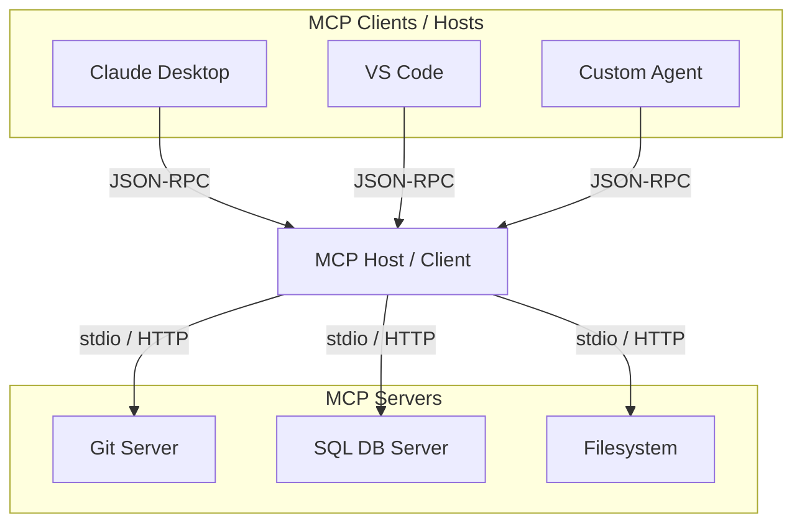

# Lesson 4: The Model Context Protocol (MCP)

As the AI agent ecosystem grows, connecting models to secure data sources and local tools has traditionally required building custom integrations for each IDE, framework, or app. In this lesson, we will explore the **Model Context Protocol (MCP)**, an open standard that addresses this challenge.

## 🎥 Lesson Video
Below is an overview video covering the key concepts in this lesson:

<div class="relative w-full aspect-video rounded-2xl overflow-hidden border border-slate-800 shadow-2xl my-8">
    <iframe class="absolute inset-0 w-full h-full" src="https://www.youtube.com/embed/_TYQod0UrQE" title="Model Context Protocol Overview" frameborder="0" allow="accelerometer; autoplay; clipboard-write; encrypted-media; gyroscope; picture-in-picture; web-share" allowfullscreen></iframe>
</div>

---

## 1. What is MCP?

Introduced as a universal standard, **Model Context Protocol (MCP)** is an open-source protocol that allows developers to build secure, standardized connections between AI models and their data sources. 

Instead of writing separate integrations for VS Code, Claude Desktop, LangChain, and custom systems, developers can write **one MCP server** that exposes tools, prompts, and resources. Any **MCP client** can instantly consume them:



---

## 2. MCP Architecture

MCP defines three main roles:

*   **MCP Client:** An application (like VS Code, Claude Desktop, or an agent framework) that wants to utilize external tools or resources. The client initiates connection to the MCP Host.
*   **MCP Host:** The orchestration layer that receives user inputs, communicates with the LLM, and routes tool-calling requests to the appropriate MCP Server.
*   **MCP Server:** A standalone service that exposes specific capabilities (Resources, Prompts, or Tools) via standard JSON-RPC over stdio or HTTP.

---

## 3. Capabilities of MCP

An MCP server can declare three main resources:
1.  **Tools:** Executable functions that the model can run (e.g. `read_file`, `execute_query`).
2.  **Resources:** Data payloads (files, API responses) that the model can read to gain context.
3.  **Prompts:** Predefined templates or system instructions that guide the model's behavior.

---

## 4. Setting Up an MCP Server

We can build MCP servers in Python or TypeScript. In the examples folder, you can view `examples/02_mcp_server.py` to inspect a minimal Python MCP server. To run an MCP server in your local IDE, you register the command inside the client's configuration file (e.g., `claude_desktop_config.json`).

---

## 5. Hands-on Playground

Run and inspect the Model Context Protocol stdio-based server code directly in your browser:

<div class="my-6 p-5 glass-panel rounded-2xl border-blue-500/20 bg-blue-950/10 flex flex-col sm:flex-row justify-between items-center gap-4">
    <div class="flex items-center gap-3">
        <span class="text-2xl">⚡</span>
        <div>
            <h4 class="text-sm font-bold text-white uppercase tracking-wider font-mono">MCP Server Interactive Sandbox</h4>
            <p class="text-xs text-slate-400 mt-0.5">Explore how the server registers weather tools and handles JSON-RPC standard stdio channels.</p>
        </div>
    </div>
    <button onclick="runLiveCode('02_mcp_server.py', 'Model Context Protocol Server')" class="text-center py-2 px-4 rounded-xl bg-blue-600 hover:bg-blue-500 text-white text-xs font-bold shadow-lg shadow-blue-500/20 transition-all cursor-pointer whitespace-nowrap">
        Access Sandbox
    </button>
</div>

### 💻 Production Implementation Guide

To run a production-ready Model Context Protocol (MCP) server locally, you can use the official `mcp` SDK (which includes the high-level `FastMCP` framework). Below is the complete server script:

#### Prerequisites
```bash
pip install mcp
```

```python
#!/usr/bin/env python3
"""
Example 02: Real-World Model Context Protocol (MCP) Server

This script demonstrates how to build a standard MCP server using the official FastMCP SDK.
It exposes a real tool and resource that can be integrated with MCP clients (like Claude Desktop or Cursor).
"""

import os
import sys

try:
    from mcp.server.fastmcp import FastMCP
except ImportError:
    print("ERROR: 'mcp' package not found.")
    print("Please run: pip install mcp")
    sys.exit(1)

# Initialize FastMCP Server
mcp = FastMCP("Bootcamp Weather Service")

# 1. Define a tool that returns weather information
@mcp.tool()
def get_weather(city: str) -> str:
    """Retrieves the current weather report for a given city.
    
    Args:
        city: The name of the city.
    """
    city_lower = city.lower()
    if "london" in city_lower:
        return "Rainy, 14°C"
    elif "san francisco" in city_lower:
        return "Foggy, 16°C"
    else:
        return "Sunny, 22°C"

# 2. Define a resource (static content)
@mcp.resource("weather://alerts")
def get_weather_alerts() -> str:
    """Returns currently active weather alerts."""
    return "ALERT: High wind advisory active for the Pacific Northwest."

if __name__ == "__main__":
    # Note: FastMCP automatically handles stdio when run directly
    mcp.run()
```

#### ⚙️ 2. Client Configurations (Claude Desktop & Cursor)

To register this server with your favorite developer tools, use the configurations below.

##### Claude Desktop
Open your `claude_desktop_config.json` (located at `~/Library/Application Support/Claude/claude_desktop_config.json` on macOS, or `%APPDATA%\Claude\claude_desktop_config.json` on Windows) and add the server definition:

```json
{
  "mcpServers": {
    "bootcamp-weather": {
      "command": "python3",
      "args": [
        "/absolute/path/to/examples/02_mcp_server_real.py"
      ]
    }
  }
}
```

##### Cursor IDE
1. Go to **Settings** &rarr; **Features** &rarr; **MCP**.
2. Click **+ Add New MCP Server**.
3. Fill in the parameters:
   * **Name**: `bootcamp-weather`
   * **Type**: `command`
   * **Command**: `python3 /absolute/path/to/examples/02_mcp_server_real.py`

---

#### 🔌 3. Custom Python MCP Client

If you want to build a custom client to query this stdio-based server programmatically, install the SDK client and use the script below:

```bash
pip install mcp
```

```python
#!/usr/bin/env python3
"""
Example 02_client: Querying the FastMCP Weather Server via stdio
"""

import asyncio
from mcp import ClientSession, StdioServerParameters
from mcp.client.stdio import stdio_client

# Define parameters to start the server process
server_params = StdioServerParameters(
    command="python3",
    args=["/absolute/path/to/examples/02_mcp_server_real.py"],
    env=None
)

async def main():
    print("[*] Connecting to FastMCP Server...")
    
    # Establish standard input/output streams
    async with stdio_client(server_params) as (read_stream, write_stream):
        async with ClientSession(read_stream, write_stream) as session:
            # Initialize connection handshake
            await session.initialize()
            print("[✔] Session initialized successfully.")
            
            # List available tools from server
            tools = await session.list_tools()
            print(f"[Client] Available Tools: {[t.name for t in tools.tools]}")
            
            # Execute tool call
            print("[Client] Calling tool 'get_weather' for 'San Francisco'...")
            response = await session.call_tool("get_weather", arguments={"city": "San Francisco"})
            
            print("\n" + "="*40 + "\n[Server Tool Output]:\n" + "="*40)
            print(response.content[0].text)

if __name__ == "__main__":
    asyncio.run(main())
```

